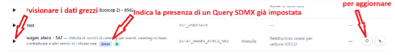
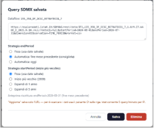
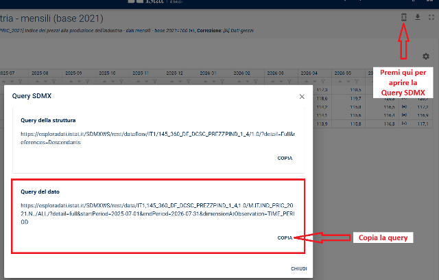
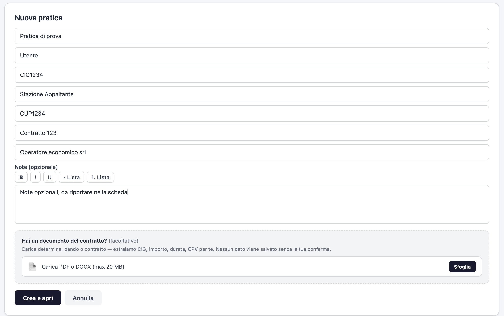
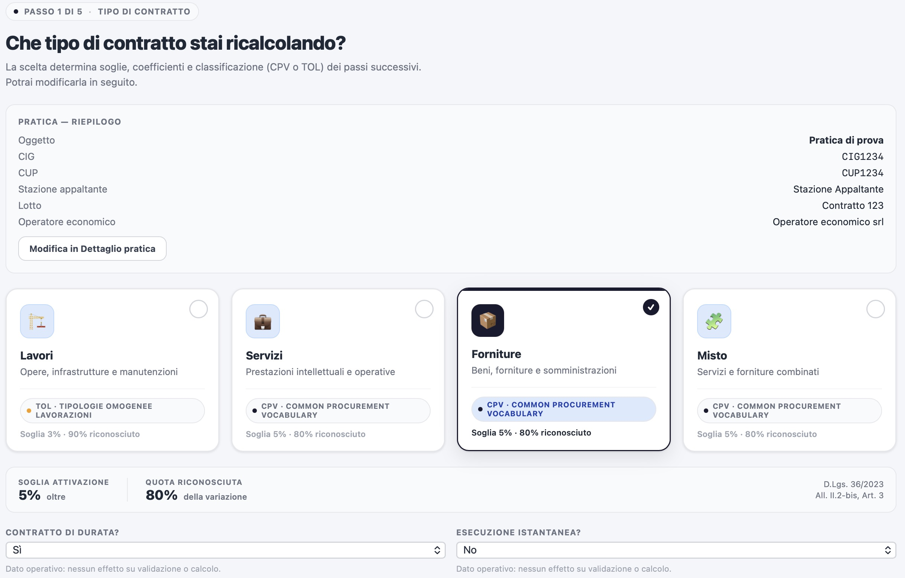
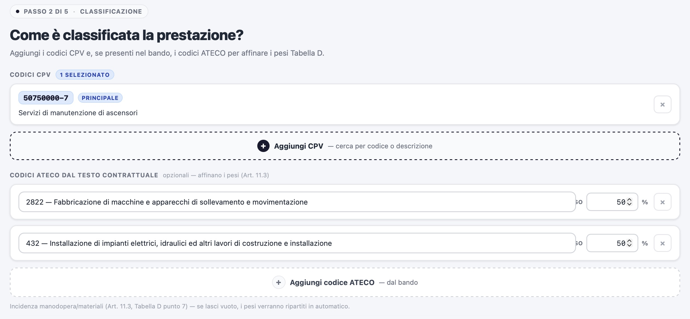
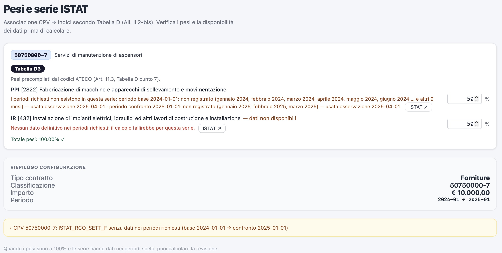
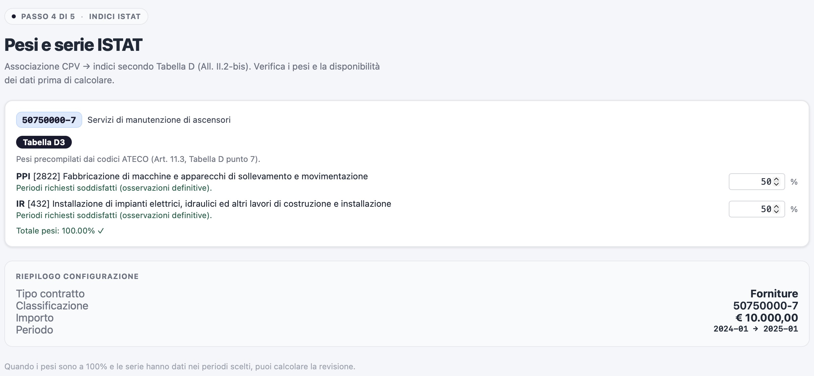
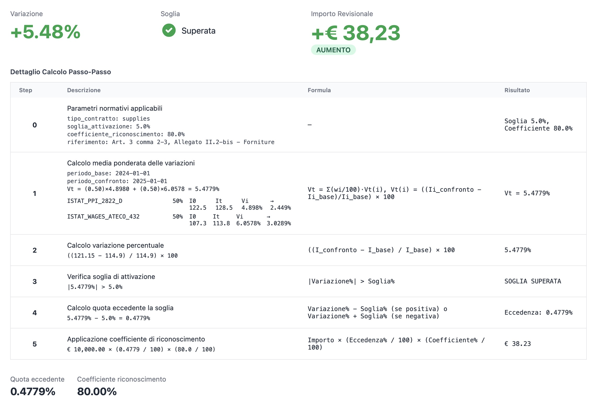

Il programma per effettuare i calcoli necessita di una serie di dati pre-impostati. Molti di questi sono statici, o abbastanza statici come il Catalogo CPV, Catalogo ATECO, Tabelle TOL. Al contrario gli Indici ISTAT subiscono continuamente aggiornamenti e vanno aggiornati.

Prima di procedere alla creazione di una pratica è bene verificare che gli Indici ISTAT in vostro possesso 1) esistano nel database, e 2) abbiano una “Query SDMX” attiva. 

Le query sono delle voci di richiamo all’interno di ISTAT che permettono di prelevare i dati grezzi per uno specifico indice, generalmente collegato ad un codice ATECO o ECOICOP.

La Query viene salvata la prima volta, e poi riutilizzata dalla macchina per le volte successive, ovvero quando sarà necessario reperire gli indici aggiornati.

Per procedere al controllo: andare nella voce di menu (in alto barra nera) **“Indici ISTAT”**. Nel primo blocco compariranno le 4 macro-sezioni relative alle tabelle D2/D3 della legge 36/2023. Poco sotto un motore di
ricerca, possiamo cercare per codice o per nome descrittivo

Se il risultato mostra una Icona **“sdmx”** significa che è già presente una query ed è solo sufficiente aggiornare i dati con i tasti funzione posti alla destra.

Il pulsante con la matita permette di modificare la base temporale.  Ovvero per default vengono aggiornati i dati fino al mese precedente, se sono disponibili. Mentre la base di partenza, cioè la data di inizio, è quella impostata al tempo del salvataggio della Query stessa. Tramite questa funzione è possibile espandere questo parametro.

Come si vede dall’immagine qui sotto, possiamo vedere la Query per esteso, e poco sotto la strategia, ovvero la data fine del periodo dei dati (tipicamente il mese precedente) e la strategia opposta, ovvero per l’inizio di cattura dei dati. Una volta salvato, è necessario poi premere il tasto aggiorna visto in precedenza per rendere effettive le modifiche.

## Cosa succede se non è presente la Query?

Dobbiamo reperirla andando a filtrare opportunamente la base dati di Istat. In alto, come anticipato, ci sono quattro macrosezioni, che corrispondono agli indici delle **tabelle D2 e D3**. Dentro ognuna di esse è presente il pulsante **“Apri EsploraDati”**, il quale ci aprirà una nuova finestra del browser portandoci dentro il database di Istat nella macro-sezione di riferimento.

Utilizziamo il tasto **“Selezioni”** (icona a forma di imbuto) in alto a sinistra, si apre una procedura a passi che può variare a seconda della sezione di riferimento. In linea di massima consiglio di compilarle tutte. Con maggiore attenzione  all’indice ATECO o codice ECOICOP che ci permetterà di ottenere l’indice preciso. Una volta applicati i filtri vedremo a video la tabella con i dati grezzi degli indici, sopra in alto a destra sono presenti tre tasti, il primo con il simbolo “< >” è la Query SDMX. Si veda l'immagine seguente:

Una volta copiata la query, torniamo a RevisionePrezzi, sempre nella pagina **“Indici ISTAT”** dove eravamo in precedenza. In alto è presente il tasto “Importa Query SDMX”, nella maschera che appare basta incollare e premere “Importa”. La macchina provvederà a scaricare i dati. A seconda della quantità richiesta potrebbe metterci anche qualche minuto.

Se abbiamo più indici richiesti dal CPV, dobbiamo ripetere la procedura per ognuno di essi. Lo scopo è di avere prima della pratica i dati più “*freschi*” possibile.

## Avvio della procedura di calcolo

Possiamo procedere alla creazione di una nuova pratica sotto “Dashboard” e quindi tasto **“+ Nuova Pratica”**.

La prima schermata chiede una serie di dati, per lo più opzionali. Se li compilate questi verranno riportati sulla scheda finale stampabile. Obbligatorio solo il “titolo della pratica”. E’ possibile anche fornire il docx o il pdf della pratica dove sono presenti il CPV, Cig, Cup eccetera, è un servizio sperimentale e potrebbe non funzionare sempre. 

Nota: **Il documento caricato viene elaborato dentro la macchina e non fa uso di servizi esterni.**

La schermata successiva ci porta alla scelta della tipologia di tipo di contratto che stiamo ricalcolando, in questa fase dobbiamo scegliere tra le 4 possibili tipologie. Indicando se si tratta di un contratto di durata e se è ad esecuzione istantanea.

Il passaggio numero due, è quello relativo all’indicazione del CPV. Attraverso la procedura possiamo richiamarlo per numero o per descrizione. Se questo ricade dentro la classificazione prevista dalla legge, ovvero le tabelle D2 o D3, **compilerà automaticamente** i codici ATECO dal testo contrattuale. 

Rimarrà in carico all’utente la ripartizione, se i codici sono più di uno, dei pesi in percentuale sulla suddivisione economica del contratto.

Il passaggio numero tre chiede l’importo su cui stiamo calcolando la rivalutazione e i riferimenti temporali. Mentre il  passaggio numero quattro è quello del controllo finale in vista del calcolo.

Qui potremo trovarci davanti a due situazioni. Se abbiamo fatto l’approvvigionamento dei dati ISTAT, come spiegato all’inizio della guida, avremo tutto verde, in caso contrario verranno emessi degli allarmi, **NON BLOCCANTI**, che ci avvisano di una o più possibili criticità. Elencandole opportunamente nel merito del problema riscontrato.

Di seguito i due esempi per immagini:

**Esempio con allarmi**

**Esempio senza allarmi**

Alla fine, nell’ultimo passaggio conclusivo, viene chiusa la pratica con l’emissione del calcolo. La scheda andrà a riepilogare tutti i punti emessi, con la massima chiarezza. In particolare, sulla composizione del calcolo con tutti i passaggi matematici.

Sul fondo della schermata sarà possibile stampare o creare un PDF. La scheda una volta chiusa **non è modificabile**, ma rimane consultabile nella sua forma del riepilogo conclusivo, sempre con la possibilità di poter stampare.

Nella dashboard sarà inoltre possibile eliminare la pratica se lo riteniamo necessario.
